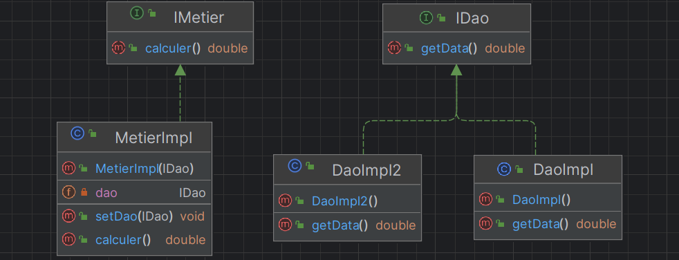

# Table of Content

1. [Couche Dao](#couche-dao)
   - [Interface IDao](#interface-idao)
   - [Class DaoImpl](#class-daoimpl)

2. [Couche Extension](#couche-extension)
   - [Class DaoImpl2](#class-daoimpl2)

3. [Couche Metier](#couche-metier)
   - [Interface IMetier](#interface-imetier)
   - [Class MetierImpl](#class-metierimpl)

4. [Couche Presentation](#couche-presentation)
   - [Injection des dépendances Par instanciation statique et dynamique](#injection-des-dépendances-par-instanciation-statique-et-dynamique)
     - [Class Pres](#class-pres)
   - [Fichier « config.txt » qui contient le nom de version a utilisé par l’application](#fichier--configtxt--qui-contient-le-nom-de-version-a-utilisé-par-lapplication)

5. [Injection des dépendances En utilisant le Framework Spring version XML](#injection-des-dépendances-en-utilisant-le-framework-spring-version-xml)
   - [Class PresSpringXML](#class-presspringxml)
   - [Fichier « config.xml » qui contient le nom de version a utilisé par l’application](#fichier--configxml--qui-contient-le-nom-de-version-a-utilisé-par-lapplication)

6. [Injection des dépendances En utilisant le Framework Spring version Annotations](#injection-des-dépendances-en-utilisant-le-framework-spring-version-annotations)
   - [Class PresSpringAnnotations](#class-presspringannotations)


-------------------------------------------------------------------------------------------



# Couche Dao
## Interface IDao
```java
package DAO;

public interface IDao {
    double getData();
}
```


## Class DaoImpl
```java
package DAO;

import org.springframework.stereotype.Component;
import org.springframework.stereotype.Repository;

//@Component
@Repository
public class DaoImpl implements IDao{
    @Override
    public double getData() {
        System.out.println("Version base de données");
        return 55;
    }
}
```

# Couche Extension
## Class DaoImpl2
```java
package DAO.EXTENSION;

import DAO.IDao;
import org.springframework.stereotype.Component;
import org.springframework.stereotype.Repository;

//@Component("V2")
@Repository("V2")
public class DaoImpl2 implements IDao {
    @Override
    public double getData() {
        System.out.println("Version web services");
        return 23.6;
    }
}
```


 
# Couche Metier
## Interface IMetier
```java
package METIER;

public interface IMetier {
    double calculer();
}
```

## Class MetierImpl
```java
package METIER;

import DAO.DaoImpl;
import DAO.IDao;
import org.springframework.beans.factory.annotation.Autowired;
import org.springframework.beans.factory.annotation.Qualifier;
import org.springframework.stereotype.Component;
import org.springframework.stereotype.Service;

//@Component
@Service
public class MetierImpl implements IMetier{
    //@Autowired
    //@Qualifier("V2")
    private IDao dao;

    public MetierImpl(@Qualifier("V2") IDao dao) {
        this.dao = dao;
    }

    public void setDao(IDao dao) {
        this.dao = dao;
    }

    @Override
    public double calculer() {
        double res = dao.getData() * 34.5;
        return res;
    }
}
```

 
# Couche Presentation
# Injection des dépendances Par instanciation statique et dynamique
## Class Pres
```java
package PRESENTATION;

import DAO.IDao;
import METIER.IMetier;

import java.io.File;
import java.lang.reflect.Method;
import java.util.Scanner;

public class Pres {
    public static void main(String[] args) throws Exception {
        //DaoImpl dao = new DaoImpl(); // Instanciation statique
        Scanner scanner = new Scanner(new File("config.txt"));
        String daoClassName = scanner.nextLine();
        Class cDao = Class.forName(daoClassName);
        IDao dao = (IDao) cDao.getConstructor().newInstance(); // => new DaoImpl()


        //MetierImpl metier = new MetierImpl();
        String metierClassName = scanner.nextLine();
        Class cMetier = Class.forName(metierClassName);
        IMetier metier = (IMetier) cMetier.getConstructor(IDao.class).newInstance(dao); // => new MetierImpl()


        // injection des dépendances par setters
        //metier.setDao(dao); // injection des dépendances statique
        //Method setDao = cMetier.getDeclaredMethod("setDao", IDao.class);
        //setDao.invoke(metier,dao); // injection des dépendances dynamique

        System.out.println(metier.calculer());
    }
}
```

# Fichier « config.txt » qui contient le nom de version a utilisé par l’application
```txt
DAO.EXTENSION.DaoImpl2
METIER.MetierImpl
```

 
# Injection des dépendances En utilisant le Framework Spring version XML
## Class PresSpringXML
```java
package PRESENTATION;

import METIER.IMetier;
import org.springframework.context.ApplicationContext;
import org.springframework.context.support.ClassPathXmlApplicationContext;

public class PresSpringXML {
    public static void main(String[] args) {
        ApplicationContext context = new ClassPathXmlApplicationContext("config.xml");
        IMetier metier = context.getBean(IMetier.class);
        System.out.println(metier.calculer());
    }
}
```

# Fichier « config.xml » qui contient le nom de version a utilisé par l’application
```xml
<?xml version="1.0" encoding="UTF-8"?>
<beans xmlns="http://www.springframework.org/schema/beans"
       xmlns:xsi="http://www.w3.org/2001/XMLSchema-instance"
       xsi:schemaLocation="http://www.springframework.org/schema/beans http://www.springframework.org/schema/beans/spring-beans.xsd">

    <bean id="dao" class="DAO.DaoImpl"/>
    <bean id="metier" class="METIER.MetierImpl">
        <!--<property name="dao" ref="dao"/>-->
        <constructor-arg ref="dao"/>
    </bean>
</beans>
```

 
# Injection des dépendances En utilisant le Framework Spring version Annotations
## Class PresSpringXML
```java
package PRESENTATION;

import METIER.IMetier;
import org.springframework.context.ApplicationContext;
import org.springframework.context.annotation.AnnotationConfigApplicationContext;
import org.springframework.stereotype.Controller;

@Controller
public class PresSpringAnnotations {
    public static void main(String[] args) {
        ApplicationContext context = new AnnotationConfigApplicationContext("DAO","METIER");
        IMetier metier = context.getBean(IMetier.class);
        System.out.println(metier.calculer());
    }
}
```

